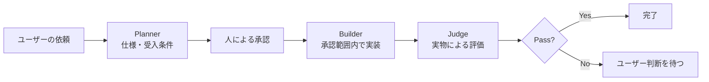

<p align="right">
  <a href="./README.md"><kbd>English</kbd></a>
  <kbd>日本語</kbd>
</p>

# Plan-Build-Judge for Cursor & Claude Code

> **コーディングエージェントが、途中で目的や範囲を変えてしまう問題をどう防ぐか。**

Plan-Build-Judge は、複雑なタスクを次の3段階に分ける、再利用可能な Agent Skill です。

**Planner → Builder → Judge**

曖昧な依頼を先に検証可能な仕様へ変換し、人の承認後にだけ実装し、最後はエージェント自身の「完了しました」という報告ではなく、ファイル、diff、ログ、テスト結果などの実物で判定します。

**先に仕様化する。承認された範囲だけ実行する。証拠で評価する。**

対応環境：**Cursor / Claude Code**  
現在のバージョン：**v0.2.0**

## なぜ作ったのか

AIコーディングエージェントを使う中で、同じ失敗が繰り返し発生しました。

1. 要件が曖昧なまま実装を始める。
2. 実装中に、依頼の範囲を暗黙に広げたり縮めたりする。
3. 実際の変更を確認せず、自分の説明だけで「完了」と判定する。

この Skill は、その失敗を明示的に扱うための保守的なワークフローです。Planner の後は原則として人の承認を待ち、Judge が Fail を返した場合も自動修正ループには入りません。次の判断を人に返します。

## ワークフロー



### Planner

曖昧な依頼を、実行可能な契約へ変換します。

- 目的
- 入力 / 出力
- 制約
- 仮定
- エッジケース
- 受入条件
- Builder 向け実行プロンプト

デフォルトでは、ここで停止して明示的な承認を待ちます。

### Builder

承認済みの仕様だけを実装します。

- スコープを暗黙に変更しない
- 制約を無視しない
- 新しい仮定が必要なら明示する
- 依頼されていない機能追加やリファクタリングを行わない

### Judge

次のような確認可能な証拠を使って判定します。

- 変更ファイルと diff
- コマンド出力
- テスト / lint 結果
- ログ
- 生成された成果物

結果は Pass / Fail、問題、重大度、修正案、再作業の要否として返します。Fail の場合は自動的に Builder へ戻らず、ユーザーの判断を待ちます。

## 対応プラットフォーム

| プラットフォーム | 英語版 | 中国語版 |
|---|---|---|
| Cursor | `.cursor/skills/plan-build-judge/SKILL.md` | `.cursor/skills/plan-build-judge-zh/SKILL.md` |
| Claude Code | `.claude/skills/plan-build-judge/SKILL.md` | `.claude/skills/plan-build-judge-zh/SKILL.md` |

同じ言語の Cursor 版と Claude Code 版は完全に同一です。`scripts/validate_skills.py` と GitHub Actions が差分を検出します。

`disable-model-invocation: true` を設定しているため、この重いワークフローはエージェントが暗黙に選ぶのではなく、ユーザーが明示的に呼び出します。

## 使い方

### プロジェクト単位

このリポジトリを clone するか、利用するプラットフォームの Skill ディレクトリを自分のプロジェクトへコピーします。

```text
your-project/
  .cursor/skills/plan-build-judge/SKILL.md
  .claude/skills/plan-build-judge/SKILL.md
```

### Cursor / Claude Code から呼び出す

```text
/plan-build-judge
Task: Refactor this CSV parser safely without changing output behavior.
```

期待される動作：

1. Planner が仕様と受入条件を作成する。
2. `LGTM`、`continue`、`続けて` などの明示的な承認を待つ。
3. Builder が承認範囲内で実装する。
4. Judge がリポジトリの証拠を確認する。
5. Fail の場合は自動修正せず停止する。

## Claude Code 向けプロジェクト設定

リポジトリ直下の `CLAUDE.md` には、次の永続的なプロジェクトルールを記録しています。

- 4つの Skill ファイルを同じ意味に保つ
- Planner 後の承認ゲートを維持する
- Judge は実物を確認する
- Fail 後に自動修正ループへ入らない
- 変更後に `python scripts/validate_skills.py` を実行する

`CLAUDE.md` はプロジェクト指示であり、セキュリティ境界ではありません。強制的な操作制限が必要な場合は、Claude Code の permissions や hooks を別途設計する必要があります。

## 検証

```bash
python scripts/validate_skills.py
```

検証内容：

- 4つの Skill ファイルが存在する
- Cursor 版と Claude Code 版が言語ごとに一致する
- 明示的起動、承認、証拠ベース評価、Fail 時停止の重要な記述が残っている

同じ検証は Pull Request ごとに GitHub Actions でも実行されます。

## 実務での利用イメージ

この構造は、単純なコード生成だけでなく、次のような業務自動化案件にも応用できます。

- 曖昧な顧客要望を業務フローと受入条件へ分解する
- 実行前に対象データ、権限、例外処理、停止条件を確認する
- 承認された範囲だけを Agent に実行させる
- 結果をログ、差分、テスト、出力ファイルで検証する
- 失敗時に無限修正を行わず、人へエスカレーションする

## 現在の限界

- 現時点では再利用可能な Skill と静的検証であり、ランタイム Agent ではありません。
- permissions や hooks による強制制御はまだ含まれていません。
- with / without の比較評価セットは未実装です。
- 実行品質は、使用モデル、ツール権限、対象リポジトリの状態にも依存します。

次の重要な作業は、再現可能な実例と評価ケースを追加し、Plan-Build-Judge の有無による差を測定することです。

## License

MIT
