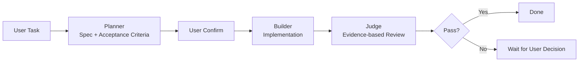
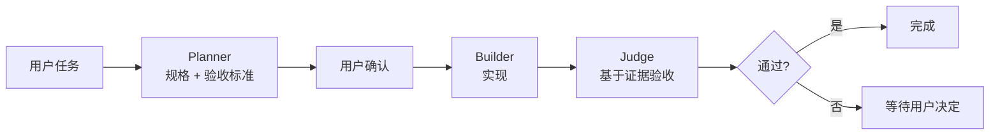

# Cursor Plan-Build-Judge

A reusable agent workflow for turning vague tasks into testable specifications, bounded execution, and evidence-based verification.

**Plan first. Build within bounds. Judge by evidence.**

This is an Agent Engineering skill, not a one-off Cursor prompt: **Planner → Builder → Judge**, with explicit approval gates and no blind self-evaluation.

Current version: **v0.1.0**

It applies a three-stage workflow:

- **Planner** — turn a vague request into a clear, testable spec
- **Builder** — implement strictly against that spec
- **Judge** — review the result against the original request, the spec, and acceptance criteria using real evidence

Differentiating defaults:

- **spec-first**
- **bounded execution**
- **evidence-based review**
- **stop after Planner** by default
- **no auto-rework** after Fail

## Engineering highlights

- **Spec-first.** Planner must emit objective, constraints, assumptions, edge cases, and acceptance criteria before any implementation.
- **Bounded execution.** Builder may not silently expand or shrink scope.
- **Evidence-based Judge.** Pass/Fail is based on diffs, files, logs, or tests — not “done”.
- **Human gates.** Default stop after Planner; Fail does not auto-rework.
- **Not a runtime agent.** This repo is a reusable skill (`SKILL.md`), not a hosted agent service or eval harness.

[中文说明](#cursor-plan-build-judge-中文)

## Quick start

```text
/plan-build-judge
Task: Refactor this CSV parser safely without changing output behavior.
```

The agent should produce a Planner spec first, then wait for your go-ahead (`LGTM` / `continue` / `按这个做`) before Builder and Judge.

## Workflow



## Why this exists

AI often fails in three ways:

1. It starts implementing too early
2. It silently changes scope while building
3. It judges its own work from summaries instead of evidence

This skill is designed to reduce those failures with:

- **spec-first** planning
- **bounded** execution
- **evidence-based** review

## Skill locations

```text
.cursor/skills/plan-build-judge/SKILL.md      # English
.cursor/skills/plan-build-judge-zh/SKILL.md   # Chinese
```

## What it does

### Planner

Outputs:

- Objective
- Inputs
- Outputs
- Constraints
- Assumptions
- Edge cases
- Acceptance criteria
- Prompt for Builder

By default, the workflow **stops after Planner** and waits for confirmation.

### Builder

- follows the approved spec strictly
- avoids scope creep
- states new assumptions clearly

### Judge

- checks actual artifacts, not just self-reported completion
- returns Pass / Fail, issues, severity, and fix suggestions
- does **not** auto-rework after Fail; it waits for the user

## When to use

Use this skill for:

- coding tasks
- scripts
- documentation generation
- structured analysis
- configuration changes
- any complex task with checkable outputs

## When not to use

Do not use this skill for:

- simple Q&A
- tiny edits
- one-shot answers where planning overhead is unnecessary

## Installation

Copy either skill folder into your Cursor project or personal skills directory.

**Project**

```text
your-project/
  .cursor/skills/plan-build-judge/
  # or
  .cursor/skills/plan-build-judge-zh/
```

**Personal (all projects)**

```text
~/.cursor/skills/plan-build-judge/
# Windows:
C:\Users\<you>\.cursor\skills\plan-build-judge\
```

Then invoke it manually as a Cursor skill (for example via `/plan-build-judge` or `/plan-build-judge-zh`).

This skill sets `disable-model-invocation: true`, so the model will not auto-select it. That is intentional for a heavyweight workflow.

### Manual install

```bash
git clone https://github.com/joker01-01/cursor-plan-build-judge.git
```

Then copy one skill folder into your workspace or personal Cursor skills directory.

## Example walkthrough

Task (intentionally vague):

> Make this API more secure.

### 1) Planner (stops here by default)

Example spec shape:

- **Objective**: Reduce common abuse and credential-exposure risks on the existing HTTP API without a full security rewrite
- **Inputs**: Current API routes/handlers, auth middleware (if any), config/env usage
- **Outputs**: Minimal code/config changes plus a short note of what was and was not hardened
- **Constraints**: No new major dependencies unless required; do not redesign the API surface; keep existing happy-path behavior
- **Assumptions** (defaults chosen because the request was vague):
  - Focus on authn/authz gaps, secrets in code/config, and basic rate limiting on sensitive endpoints
  - Out of scope: WAF, infra hardening, pentest, full OWASP program
- **Edge cases**: Missing auth middleware; local-only dev routes; endpoints that must stay public
- **Acceptance criteria**:
  1. Sensitive endpoints require authentication unless explicitly marked public
  2. No secrets hardcoded in source
  3. Login/auth-sensitive route has rate limiting with a documented limit
  4. Unauthenticated access to protected routes fails with the existing error style
- **Prompt for Builder**: Implement only the items above; do not refactor unrelated code.

User go-ahead examples: `LGTM`, `继续`, `按这个做`.

### 2) Builder

Implements only the approved security scope. Does not "also clean up" unrelated files.

### 3) Judge

Reviews with evidence, for example:

- diff shows auth checks and rate-limit wiring on the agreed routes
- secret scan / file inspection shows no hardcoded credentials
- a request/repro note or test output shows protected routes reject anonymous access

Possible Judge result:

- **Verdict**: Fail
- **Issue**: Rate limiting was added globally instead of only on sensitive routes
- **Severity**: High
- **Rework needed**: Yes

The workflow stops there until the user asks for changes.

## Relationship to Cursor User Rules

You can keep a short personal rule that reminds the agent to use Planner → Builder → Judge on complex tasks.

Use:

- a **short user rule** for default reminders
- this **skill** as the full stage contract when you explicitly invoke it

## Files

- `.cursor/skills/plan-build-judge/SKILL.md`
- `.cursor/skills/plan-build-judge-zh/SKILL.md`
- `README.md`
- `LICENSE`

## License

MIT

---

# Cursor Plan-Build-Judge（中文）

**先规格化，再受控执行，最后基于证据验收。**

一个可复用的 Cursor Skill，用于复杂任务。  
当前版本：**v0.1.0**

它采用三阶段工作流：

- **Planner（规划）** — 把模糊需求变成清晰、可验收的规格
- **Builder（执行）** — 严格按规格实现
- **Judge（验收）** — 对照原始需求、规格与验收标准，基于真实证据审查结果

差异化默认行为：

- **先规格化（spec-first）**
- **执行不越界（bounded execution）**
- **验收看证据（evidence-based review）**
- **默认 Planner 后停住**
- **Fail 后不自动返工**

[Back to English](#cursor-plan-build-judge)

## 最短上手

```text
/plan-build-judge-zh
任务：在不改变输出行为的前提下，重构这个 CSV 解析脚本。
```

Agent 应先产出 Planner 规格，再等你放行（`LGTM` / `继续` / `按这个做`），然后进入 Builder 与 Judge。

## 流程图



## 为什么需要它

AI 常在三件事上失手：

1. 还没澄清需求就直接开写
2. 实现时偷偷改范围
3. 审查时只根据自己刚写的摘要打分

这个 Skill 用三点来降低这些失败：

- **先规格化（spec-first）**
- **执行不越界（bounded execution）**
- **验收看证据（evidence-based review）**

## Skill 位置

```text
.cursor/skills/plan-build-judge/SKILL.md      # 英文
.cursor/skills/plan-build-judge-zh/SKILL.md   # 中文
```

## 它做什么

### Planner

输出：

- 目标
- 输入
- 输出
- 约束
- 假设
- 边界情况
- 验收标准
- 给 Builder 的执行提示

默认在 **Planner 之后停住**，等待确认。

### Builder

- 严格按已确认规格执行
- 避免范围蔓延
- 新假设必须说清楚

### Judge

- 检查实际产物，而不是只看「已完成」自述
- 输出：通过/不通过、问题、严重程度、修改建议
- **不通过后不自动返工**，等待用户决定

## 何时使用

适合：

- 编码任务
- 脚本
- 文档生成
- 结构化分析
- 配置修改
- 任何有可检查产物的复杂任务

## 何时不要使用

不适合：

- 简单问答
- 极小改动
- 规划成本明显高于收益的一步直出场景

## 安装

把对应 Skill 目录复制到 Cursor 项目或个人 skills 目录。

**项目级**

```text
你的项目/
  .cursor/skills/plan-build-judge/
  # 或
  .cursor/skills/plan-build-judge-zh/
```

**个人级（所有项目可用）**

```text
~/.cursor/skills/plan-build-judge/
# Windows:
C:\Users\<你的用户名>\.cursor\skills\plan-build-judge\
```

然后在 Cursor 里手动调用（例如 `/plan-build-judge` 或 `/plan-build-judge-zh`）。

本 Skill 设置了 `disable-model-invocation: true`，模型不会自动选用。这对重流程 Skill 是有意为之。

### 手动安装

```bash
git clone https://github.com/joker01-01/cursor-plan-build-judge.git
```

然后把其中一个 skill 文件夹复制到工作区或个人 Cursor skills 目录。

## 示例走读

任务（故意模糊）：

> 把这个 API 变得更安全。

### 1）Planner（默认先停在这里）

规格示例：

- **目标**：在不做全面安全重写的前提下，降低现有 HTTP API 的常见滥用与凭据暴露风险
- **输入**：当前 API 路由/处理逻辑、鉴权中间件（如有）、配置/环境变量用法
- **输出**：最小代码/配置改动，并简要说明加固了什么、没做什么
- **约束**：除非必要不引入大型新依赖；不重做 API 表面；保持现有主路径行为
- **假设**（因需求模糊而主动给定的默认）：
  - 聚焦鉴权缺口、代码/配置中的秘密信息、敏感接口的基础限流
  - 不做 WAF、基建加固、渗透测试或完整 OWASP 专项
- **边界情况**：缺少鉴权中间件；仅本地开发路由；必须保持公开的接口
- **验收标准**：
  1. 敏感接口默认需要认证，除非明确标记为公开
  2. 源码中无硬编码秘密
  3. 登录/鉴权相关路由有限流，并写明限额
  4. 未认证访问受保护路由时，错误风格与现有一致
- **给 Builder 的执行提示**：只实现以上条目，不要重构无关代码

用户放行示例：`LGTM`、`继续`、`按这个做`。

### 2）Builder

只实现已确认的安全范围，不「顺便」清理无关文件。

### 3）Judge

基于证据审查，例如：

- diff 显示约定路由上的鉴权与限流改动
- 文件检查确认无硬编码凭据
- 请求复现说明或测试输出显示受保护路由会拒绝匿名访问

可能的 Judge 结果：

- **结论**：不通过
- **问题**：限流被加到了全局，而不是只加在敏感路由
- **严重程度**：高
- **是否需要返工**：是

然后停住，等用户决定是否修改。

## 与 Cursor User Rule 的关系

你可以保留一条简短的个人 Rule，提醒模型在复杂任务时走「规划 → 执行 → 验收」。

建议分工：

- **短 Rule**：默认提醒
- **本 Skill**：显式调用时的完整阶段约定

## 文件

- `.cursor/skills/plan-build-judge/SKILL.md`
- `.cursor/skills/plan-build-judge-zh/SKILL.md`
- `README.md`
- `LICENSE`

## 许可

MIT
