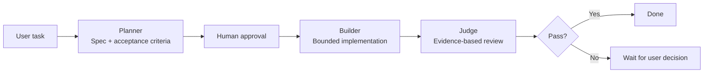

# Cursor Plan-Build-Judge

> **How do you stop coding agents from drifting?**

Cursor Plan-Build-Judge is a reusable Agent Engineering workflow for complex tasks:

**Planner → Builder → Judge**

The idea is simple: turn a vague request into a testable spec first, keep implementation inside approved bounds, and judge the result from real repository evidence instead of the agent saying “done”.

**Plan first. Build within bounds. Judge by evidence.**

Current version: **v0.1.0**

## Why I built it

While using coding agents, I kept seeing the same failure pattern:

1. They start implementing before the task is clear.
2. They silently expand or shrink scope while building.
3. They review their own work from a summary instead of checking what actually changed.

This workflow is my attempt to make those failure modes explicit and controllable.

It is deliberately conservative: Planner stops for approval by default, Builder works against the approved spec, Judge looks for evidence, and a failed review does not trigger blind automatic rework.

## The workflow



### Planner

Turns a vague task into an explicit contract:

- objective
- inputs / outputs
- constraints
- assumptions
- edge cases
- acceptance criteria
- implementation prompt for Builder

By default, the workflow **stops here** and waits for approval.

### Builder

Implements only the approved scope:

- follow the spec
- avoid scope creep
- state new assumptions
- do not redefine acceptance criteria mid-task

### Judge

Checks the result against evidence:

- diffs
- changed files
- logs
- tests
- reproducible checks

It returns Pass / Fail, issues, severity, and rework guidance. A Fail does **not** automatically loop back into Builder.

## What makes it different

- **Spec-first.** Implementation starts from explicit acceptance criteria.
- **Bounded execution.** Builder is not allowed to quietly change the job.
- **Evidence-based review.** The Judge checks artifacts, not self-reported completion.
- **Human gates.** Approval is part of the workflow, not an afterthought.
- **No blind self-healing loop.** Failed work stops for a decision instead of recursively editing itself.

This repo is a reusable Cursor Skill, not a hosted runtime agent or a benchmark harness.

## Quick start

```text
/plan-build-judge
Task: Refactor this CSV parser safely without changing output behavior.
```

Expected behavior:

1. Planner writes the spec.
2. Agent waits for `LGTM`, `continue`, `继续`, or another explicit go-ahead.
3. Builder implements within scope.
4. Judge checks the result using repository evidence.
5. Fail stops and returns control to the user.

## Example

Task:

> Make this API more secure.

A useful Planner should not translate that directly into “rewrite security”. It should make the scope testable, for example:

- protect sensitive endpoints with authentication
- remove hardcoded secrets
- add rate limiting to auth-sensitive routes
- preserve existing public endpoints and error style
- avoid unrelated refactors

Builder then implements those approved items only.

Judge should look for evidence such as:

- diff shows auth checks on agreed routes
- file inspection / secret scan shows no hardcoded credentials
- tests or request reproduction show anonymous access is rejected
- rate limiting is applied where the spec said it should be

If rate limiting was accidentally added globally, Judge should return Fail and stop rather than silently rewriting the implementation.

## Install

Skill files:

```text
.cursor/skills/plan-build-judge/SKILL.md
.cursor/skills/plan-build-judge-zh/SKILL.md
```

Project-level installation:

```text
your-project/
  .cursor/skills/plan-build-judge/
```

Personal installation:

```text
~/.cursor/skills/plan-build-judge/
# Windows
C:\Users\<you>\.cursor\skills\plan-build-judge\
```

Or clone the repository first:

```bash
git clone https://github.com/joker01-01/cursor-plan-build-judge.git
```

Then copy the desired skill directory into the project or personal Cursor skills directory.

The skill sets `disable-model-invocation: true`, so Cursor will not silently auto-select this heavyweight workflow. Invocation is intentional.

## When to use it

Good fit:

- coding tasks with multiple files
- refactors with behavior constraints
- scripts and configuration changes
- documentation or structured outputs with acceptance criteria
- tasks where “done” can be checked

Poor fit:

- simple Q&A
- tiny edits
- one-step tasks where planning costs more than the work

## Current gap

The workflow is documented and usable as a Skill, but the repository is not yet an eval harness.

The next useful step is to add real cases such as:

```text
examples/
  01-refactor/
    task.md
    planner-output.md
    builder-diff.md
    judge-report.md
```

and eventually compare **with vs without Plan-Build-Judge** on a small set of repeatable tasks.

That would turn the design claim into stronger empirical evidence.

## License

MIT

<details>
<summary><strong>中文说明</strong></summary>

<br>

> **怎么让 coding agent 不要越做越偏？**

这个项目把复杂任务拆成三个明确阶段：

**Planner → Builder → Judge**

Planner 先把模糊需求变成可验收规格；Builder 只在已确认边界内实现；Judge 最后看 diff、文件、日志、测试等真实证据，而不是听模型自己说“做完了”。

我做它主要是因为 coding agent 经常在三件事上出问题：还没想清楚就开写、实现过程中偷偷改范围、最后根据自己的摘要给自己打分。

所以这套流程默认比较保守：Planner 后停住等人确认；Fail 后也不会自动递归返工，而是把控制权交回给人。

当前它还是一个可复用 Skill，不是 runtime agent，也不是 eval harness。下一步最值得补的是一组真实案例和 with/without 对比，让“可靠性提升”不只停留在设计描述上。

</details>
